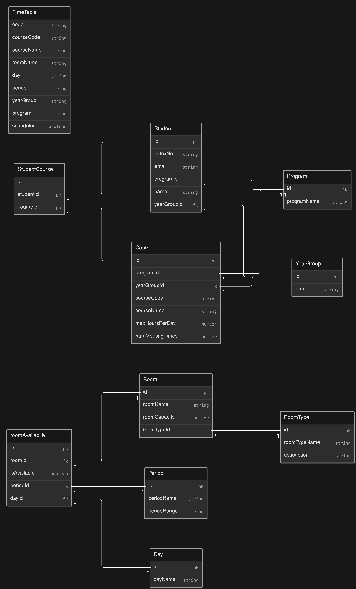

# Smart-timetable

## ER Diagram

## Technologies 

* **Nodejs - Run time for javascript for bulding server-side applications**
* **ExpressJs - FrameWork for building apis**
* **MongoDb - Nosql database**
* **Mongoose - object modeling tool for javascript and nodejs**

## Api Endpoints

| Endpoint              | Method | Description                                                    |
| --------------------- | ------ | -------------------------------------------------------------- |
| /api/courses          | GET    | Get all courses with the total students appended               |
| /api/roomAvailability | GET    | Get all rooms available for scheduling( ie  exluding Offices) |
| /api/rooms            | GET    | Get all rooms                                                  |
| /api/students         | GET    | Get all students                                               |
| /api/students         | POST   | Add  a student to the database                                |
| /api/schedule/:code   | GET    | Get timetable based on the code for uniqueness                 |
| /api/schedule/:code   | POST   | Generate timetable for with code for uniqueness                |
